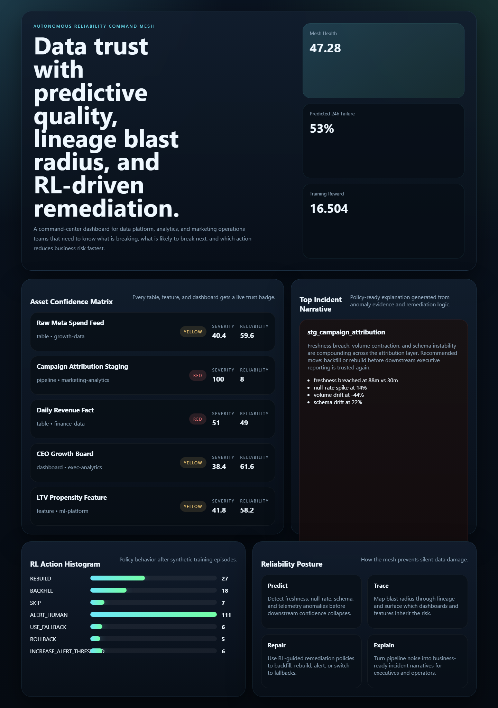

# data-reliability-mesh-rl

Autonomous data reliability mesh for **predictive data quality**, **lineage-aware blast radius analysis**, and **reinforcement-learning remediation**.



[](https://www.python.org/)
[](https://react.dev/)
[](LICENSE)
[](.github/workflows/ci.yml)

`data-reliability-mesh-rl` is a hyper-technical open-source platform for teams that want to move from reactive data quality monitoring to predictive, autonomous, and lineage-aware reliability operations.

It combines:

- anomaly detection on data and metadata
- causal lineage traversal with propagation probabilities
- a reinforcement-learning-inspired remediation engine
- contract validation and confidence scoring
- a command center dashboard for trust, incident, and blast-radius review

## Why This Repo Exists

Most data quality tools tell you something broke after downstream dashboards are already wrong. This project is built around a different operating model:

- predict likely failure before stakeholders trust the wrong metric
- quantify blast radius through lineage, not flat alerts
- recommend or simulate remediation actions with learned policy behavior
- keep a single reliability score for tables, marts, dashboards, and features

## Functional Core

The verified runnable surfaces in this repository are:

- a **Python package** for anomaly scoring, lineage propagation, contract checks, and RL-style remediation policy learning
- a **FastAPI control plane** exposing overview, contracts, incident, and lineage APIs
- a **React + TypeScript dashboard** with a distinctive reliability command-center interface
- a **simulation loop** that trains the remediation agent on synthetic data incidents

## Polyglot Platform Surfaces

To reflect a real enterprise reliability platform, the repository also includes serious starter surfaces for:

- **Rust** streaming anomaly detection
- **Go** lineage graph APIs and remediation execution
- **Scala** offline propagation learning
- **Java** Flink-style telemetry enrichment
- **Cypher** lineage traversal queries
- **SQL** self-healing contract procedures
- **C++** high-throughput distance kernels
- **Helm / Kubernetes** deployment assets

These modules are intentionally structured so the verified Python and frontend core can expand into a larger polyglot control plane without rewriting the architecture.

## Repository Layout

```text
data-reliability-mesh-rl/
├── apps/dashboard/              # React + Vite control tower
├── services/mesh_api/           # FastAPI control plane
├── src/data_reliability_mesh/   # Core engine, simulator, lineage, contracts
├── anomaly-detector/            # Rust streaming anomaly surface
├── lineage-builder/             # Go lineage ingestion API
├── remediation-executor/        # Go action runner
├── causal-propagator/           # Scala offline learning job
├── contracts/                   # SQL contract enforcement
├── cypher/                      # Neo4j lineage and RCA queries
├── cpp/                         # High-throughput native kernels
├── kubernetes/                  # Helm chart
├── tests/                       # Unit and smoke verification
└── docs/                        # Architecture, audit, screenshots
```

## Quick Start

### 1. Install Python dependencies

```bash
python -m venv .venv
.venv\Scripts\activate
pip install -r requirements.txt
```

### 2. Install dashboard dependencies

```bash
npm --prefix apps/dashboard install
```

### 3. Run the API

```bash
python -m uvicorn services.mesh_api.app.main:app --host 127.0.0.1 --port 8014
```

### 4. Run the dashboard

```bash
npm --prefix apps/dashboard run dev
```

## Verified Endpoints

- `GET /health`
- `GET /api/overview`
- `GET /api/assets`
- `GET /api/contracts`
- `GET /api/lineage/{asset_id}`
- `GET /api/incidents/{asset_id}`
- `POST /api/train`

## Verification

This repo was built to be testable from a fresh checkout:

```bash
python -m pytest tests -q
python -m compileall services src tests
npm --prefix apps/dashboard run build
```

## Docs

- [Architecture](docs/architecture.md)
- [Final audit](docs/final-audit.md)
- [Contributing](CONTRIBUTING.md)
- [Security policy](SECURITY.md)
- [Authors](AUTHORS.md)

